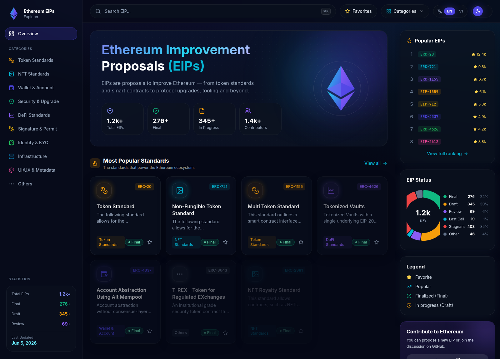
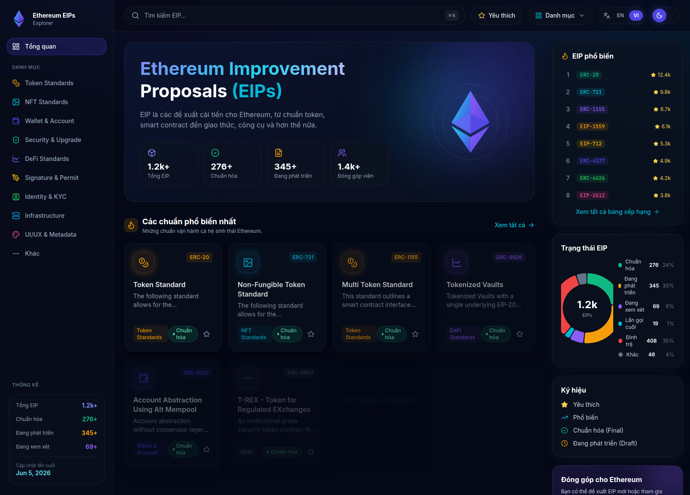
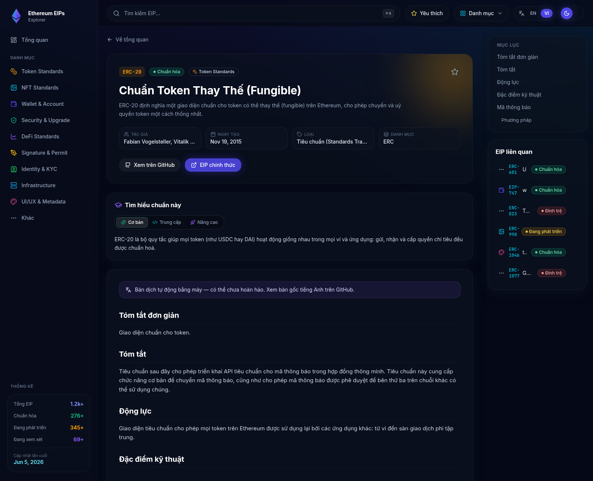

# Ethereum EIP Explorer

A production-ready explorer for **every Ethereum Improvement Proposal (EIP)** and **ERC standard** — browse, search, learn and understand the relationships between standards. Built to feel like _Ethereum Docs + Wikipedia + Developer Portal + Learning Platform_.

Futuristic / web3 / premium-SaaS dark UI with glassmorphism and neon glow. **No database** — the GitHub `ethereum/EIPs` repository is the source of truth and all data lives on the filesystem as static JSON.

## 🖼️ Demo

### Dashboard (English)


### Dashboard (Tiếng Việt)


### EIP detail with Vietnamese machine-translated spec & learning mode


## ✨ Features

- **Dashboard** — animated hero, popular standards grid, status distribution donut, popular-EIP ranking, legend & contribution panels.
- **Full EIP detail pages** — metadata, rendered markdown with syntax-highlighted code + copy buttons, table of contents, `requires`/`replaces` graph links, related EIPs.
- **Multi-language (EN / VI)** — localized UI, status/type/category labels, section headings, and **machine-translated EIP specifications** in Vietnamese; `/en` & `/vi` routes, `hreflang`, locale persisted via cookie + localStorage.
- **Web3 Learning Mode** — Beginner / Intermediate / Advanced explanations for every major EIP, in both languages.
- **Instant search (Fuse.js)** — `⌘K` command palette + `/search` page, works in English and Vietnamese, search by number, ERC/EIP id, title, keyword, author or category.
- **Categories** — Token, NFT, Wallet & Account, Security & Upgrade, DeFi, Signature & Permit, Identity & KYC, Infrastructure, Metadata, Others.
- **Charts (Recharts)** — status distribution, growth by year, popular categories, most-referenced standards.
- **Favorites** — saved locally with Zustand persistence.
- **SEO** — metadata, Open Graph, Twitter cards, sitemap, robots, `en-US` / `vi-VN` hreflang.
- **Performance** — Server Components, ISR, static generation, lazy/dynamic imports, image optimization.

## 🧱 Tech stack

Next.js 15 (App Router) · React 19 · TypeScript · TailwindCSS · shadcn-style UI · Framer Motion · Lucide · Recharts · Fuse.js · react-markdown (MDX-style rendering) · Zustand · `gray-matter`.

**No PostgreSQL / Prisma / Supabase / Firebase / MongoDB.** Filesystem only.

## 📁 Project structure

```
.
├─ public/data/                 # generated static data (source of truth at runtime)
│  ├─ eips.json                 # full corpus
│  ├─ categories.json           # taxonomy + counts
│  ├─ stats.json                # aggregate stats + most-referenced
│  ├─ search-index.json         # slim docs for Fuse.js
│  ├─ translations/vi/eip-*.json
│  └─ learning/{en,vi}/eip-*.json
├─ scripts/
│  ├─ sync-eips.ts              # clone ethereum/EIPs + ERCs, parse, regenerate JSON
│  ├─ generate-data.ts          # build JSON from bundled curated dataset (offline)
│  ├─ generate-translations.ts  # write VI translations + learning content
│  └─ lib/write-data.ts         # shared JSON writer (stats, search index, popularity)
├─ src/
│  ├─ app/
│  │  ├─ [lang]/                 # locale-scoped routes
│  │  │  ├─ page.tsx             # dashboard
│  │  │  ├─ eips/[id]/page.tsx   # EIP detail
│  │  │  ├─ categories/[slug]/   # category listing
│  │  │  ├─ search/ · favorites/
│  │  │  └─ layout.tsx           # sidebar + header + command palette
│  │  ├─ api/revalidate/         # daily ISR revalidation (Vercel cron)
│  │  ├─ sitemap.ts · robots.ts · not-found.tsx · layout.tsx · page.tsx
│  ├─ components/                # Sidebar, Header, Hero, cards, charts, markdown, …
│  ├─ lib/                       # data, stats, search, i18n, categories, utils, store
│  │  └─ data/                   # seed-eips, aggregate-stats, translations
│  └─ middleware.ts              # locale detection / redirect
├─ .github/workflows/           # ci.yml · sync-eips.yml
└─ vercel.json
```

## 🚀 Getting started

```bash
npm install
npm run generate:data          # writes public/data/*.json from the curated dataset
npm run generate:translations  # writes VI translations + learning content
npm run dev                     # http://localhost:3000  (→ /en)
```

The app ships with a curated dataset so it renders immediately with **no network and no database**.

## 🔄 Syncing the full corpus from GitHub

```bash
npm run sync:eips
```

### Vietnamese specifications

EIP bodies are machine-translated into Vietnamese and stored as static files
(`public/data/translations/vi/eip-<id>.json`). Code blocks, inline code and
identifiers (`EIP-721`, `0x…`) are preserved; only prose is translated. A
"machine-translated" banner is shown and the English original is always linked.

```bash
npm run translate:vi -- --popular        # headline standards (default)
npm run translate:vi -- --all --limit 100  # batch the long tail (CI-friendly, resumable)
```

This shallow-clones `ethereum/EIPs` (and `ethereum/ERCs`), parses every markdown file's frontmatter (`eip`, `title`, `status`, `type`, `category`, `author`, `created`, `requires`, `replaces`), grafts curated popularity/tags onto the headline standards, and regenerates all `public/data/*.json` indexes. Runs daily via the **Sync EIPs** GitHub Action, which commits any changes.

## 🌐 Routes

| Route | Description |
|---|---|
| `/` | redirects to detected locale (`/en` or `/vi`) |
| `/[lang]` | dashboard |
| `/[lang]/eips/[id]` | EIP detail (e.g. `/en/eips/20`, `/vi/eips/20`) |
| `/[lang]/categories/[slug]` | category listing (`token`, `nft`, `defi`, …) |
| `/[lang]/search` | full search page |
| `/[lang]/favorites` | saved EIPs |

## 🎨 Design tokens

| Token | Value |
|---|---|
| Background | `#050816` |
| Cards | `#0B1220` |
| Primary | `#4F46E5` |
| Secondary | `#06B6D4` |
| Accent | `#8B5CF6` |
| Success / Warning / Error | `#10B981` / `#F59E0B` / `#EF4444` |

## ☁️ Deploy to Vercel

1. Push to GitHub and import the repo on Vercel (framework auto-detected as Next.js).
2. Set `NEXT_PUBLIC_SITE_URL` to your production URL.
3. Deploy. `prebuild` generates data if missing; the cron in `vercel.json` revalidates daily.

```bash
npm i -g vercel && vercel --prod
```

## 📜 Scripts

| Command | Description |
|---|---|
| `npm run dev` | Start dev server |
| `npm run build` | Production build (runs `prebuild` data generation) |
| `npm run start` | Start production server |
| `npm run sync:eips` | Pull + parse EIPs from GitHub and rebuild JSON |
| `npm run generate:data` | Build JSON from the curated dataset |
| `npm run generate:translations` | Build curated VI translation + learning JSON |
| `npm run translate:vi -- --popular` | Machine-translate EIP specs to Vietnamese (`--all`, `--ids 20,721`, `--limit N`, `--force`) |
| `npm run typecheck` | `tsc --noEmit` |

## License

MIT — EIP content © their respective authors, sourced from [ethereum/EIPs](https://github.com/ethereum/EIPs).
